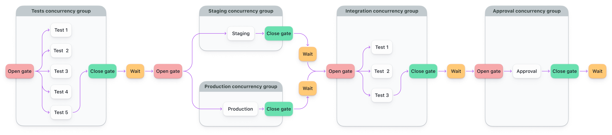

# Buildkite Concurrency Gates with Parallelism Pipeline Example

This repository demonstrates how to use [Buildkite](https://buildkite.com/) concurrency groups and gates to control the flow of a pipeline.
It shows how to combine **parallelism**, **step dependencies**, and **concurrency limits** to model gated workflows.

👉 **See this pipeline in action:** [buildkite.com/buildkite/concurrency-group-pipeline-example](https://buildkite.com/buildkite/concurrency-group-pipeline-example/builds/latest?branch=main)

<!-- docs:start -->

## How it works
This example models a simple gated workflow with concurrency limits and parallelism:

1. The **Running concurrency gate example** step prints a quick message to start the pipeline.
2. The **Tests** step runs in parallel (up to 5 at once), controlled by a concurrency gate.
3. When tests finish, the gates for **Deploy to Staging** and **Deploy to Production** open. These run independently.
4. Once both deploy steps complete, **Integration Tests** run in parallel (up to 3 at once).
5. After integration tests finish, the **Approve Deployment** step is triggered.

> 🔄 **Parallelism** runs multiple jobs at once.
> ⛔ **Concurrency groups** limit how many jobs run at once — even across separate builds.
>
> Think of concurrency like a traffic light: it controls flow, even when you’ve got lots of lanes.

More on this in the [Buildkite docs on controlling concurrency](https://buildkite.com/docs/pipelines/configure/workflows/controlling-concurrency).

## Pipeline Steps

- **Running concurrency gate example**: Just prints a message to kick things off.
- **Tests**: Runs up to 5 jobs in parallel, using the `tests` concurrency group.
- **Deploy to Staging**: Waits for tests to finish. Uses the `deploy-staging` concurrency group.
- **Deploy to Production**: Also waits for tests. Uses the `deploy-production` concurrency group.
- **Integration Tests**: Waits for both deploy steps. Runs up to 3 jobs in parallel in the `integration-tests` group.
- **Approve Deployment**: Waits for integration tests, and runs in the `approval` concurrency group.

Each step uses `depends_on` and `concurrency_group` to manage gates and limits.

## 🧠 Advanced Usage Notes

This setup mixes `depends_on` with concurrency groups to create gates between phases.

You can:
- Gate steps across branches or fan-in/fan-out setups
- Limit job execution globally (not just per pipeline)
- Create human approval gates at the end of automated flows

Want help modeling a complex pipeline? [Reach out to support](https://buildkite.com/support) — we love this stuff.

<!-- docs:end -->

## License

See [LICENSE](LICENSE) (MIT)