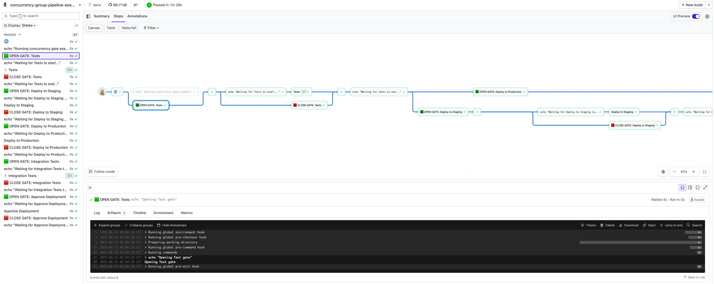
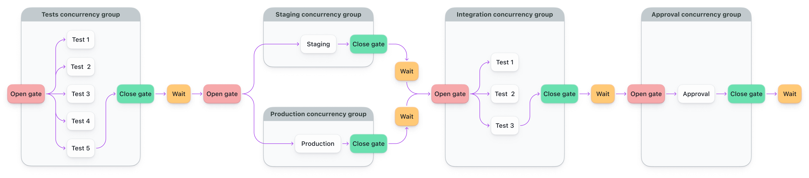

# Buildkite Concurrency Gates with Parallelism Pipeline Example

This repository is an example configuration for Buildkite that demonstrates the use of concurrency groups and gates to control the execution flow of your pipeline steps. It showcases the concept of parallelism and how concurrency gates can be used to manage dependencies between steps.

👉 **Live Pipeline:** [buildkite.com/buildkite/concurrency-group-pipeline-example](https://buildkite.com/buildkite/concurrency-group-pipeline-example)

See the full [Getting Started Guide](https://buildkite.com/docs/guides/getting-started) for step-by-step instructions on how to get this running, or [Add to Buildkite](https://buildkite.com/new) to try it yourself.

## How does it work?
This example pipeline demonstrates the following execution flow:

1. The pipeline starts with the **Running concurrency gate example** step, which serves as an initial message.

2. The **Tests** step runs in parallel with a maximum of 5 parallel test executions. This gate opens at the start of the pipeline and closes upon the completion of the **Tests** step.

3. Once the **Tests** step completes, the **Deploy to Staging** step opens the gate for deploying to the staging environment. The **Deploy to Production** gate also opens simultaneously. Both gates remain open until their respective steps complete.

4. The **Integration Tests** step waits for both the **Deploy to Staging** and **Deploy to Production** steps to finish before running. It allows up to 3 parallel integration test runs. This gate opens once both the **Deploy to Staging** and **Deploy to Production** steps complete and closes upon the completion of the **Integration Tests** step.

5. Finally, the **Approve Deployment** step opens the gate for approving the deployment. It waits for the completion of the **Integration Tests** step before running. This gate remains open until the **Approve Deployment** step is completed.

> 🔄 **Parallelism** means running things at the same time.
>
> ⛔ **Concurrency groups** *limit* how many things can run at once - even across separate builds.
>
> You can think of concurrency as a traffic light - it controls how many cars go through, no matter how many lanes are open.

For more detail, see the [Buildkite docs on controlling concurrency](https://buildkite.com/docs/pipelines/configure/workflows/controlling-concurrency).

## Pipeline Steps Overview

The pipeline consists of the following steps:

1. **Running concurrency gate example**: This step serves as an introductory step and simply echoes a message to indicate the start of the pipeline.

2. **Tests**: This step represents running tests. It utilizes concurrency and parallelism to control the number of parallel test executions. The step is associated with a concurrency group named **"tests"** and has a parallelism value of 5. This means that up to 5 parallel test runs can occur at the same time. It has no explicit dependency on other steps.

3. **Deploy to Staging**: This step opens the gate for deploying to the staging environment. It depends on the completion of the **Tests** step and waits for it to finish before proceeding. This step is part of the **"deploy-staging"** concurrency group. It has a `depends_on: ["wait-end-tests"]` gate for the step **Tests** to ensure that the deployment to staging happens only after the tests have completed.

4. **Deploy to Production**: Similar to the **Deploy to Staging** step, this step opens the gate for deploying to the production environment. It also depends on the completion of the **Tests** step. This step is part of the **"deploy-production"** concurrency group. It has a `depends_on: ["wait-end-tests"]` gate for the step **Tests** to ensure that the deployment to production happens only after the tests have completed.

5. **Integration Tests**: This step represents running integration tests. It depends on the completion of both the **Deploy to Staging** and **Deploy to Production** steps. The step is associated with a concurrency group named **"integration-tests"** and has a parallelism value of 3, allowing up to 3 parallel integration test runs. It has a `depends_on: ["wait-end-deploy-staging", "wait-end-deploy-production"]` gate for the steps **Deploy to Staging** and **Deploy to Production** to ensure that the integration tests run only after both staging and production deployments have completed.

6. **Approve Deployment**: This step opens the gate for approving the deployment. It depends on the completion of the **Integration Tests** step. This step is part of the **"approval"** concurrency group. It has a `depends_on: ["wait-end-integration-tests"]` gate for the step **Integration Tests** to ensure that the deployment approval happens only after the integration tests have completed successfully.

## 🧠 Advanced Usage Notes

This example uses `depends_on` and concurrency groups together to model gated workflows.
For more advanced setups — such as gating steps across complex conditions or multiple fan-in/fan-out branches — you can adapt these patterns with `depends_on` and `concurrency` to simulate advanced step control.

We recommend:
- Being explicit with `depends_on` to control flow
- Keeping concurrency group names consistent and descriptive

Want help modeling a complex pipeline? [Reach out to support](https://buildkite.com/support) — we love this stuff.

## License

See [LICENSE.md](LICENSE.md) (MIT)