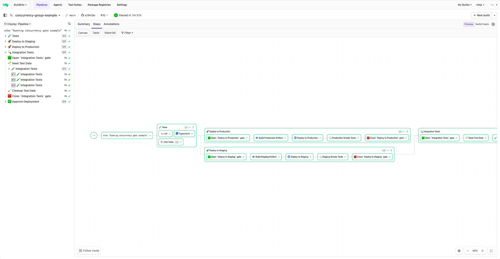
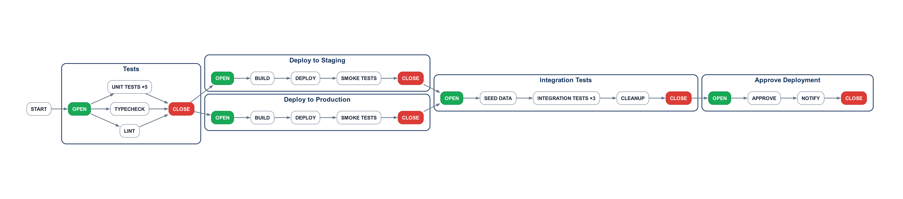

# Buildkite Concurrency Gates with Parallelism Pipeline Example

This repository demonstrates how to use [Buildkite](https://buildkite.com/) concurrency groups and gates to control the flow of a pipeline.
It shows how to combine **parallelism**, **step dependencies**, and **concurrency limits** to model gated workflows.

👉 **See this pipeline in action:** [buildkite.com/buildkite/concurrency-group-pipeline-example](https://buildkite.com/buildkite/concurrency-group-pipeline-example/builds/latest?branch=main)

See the full [Getting Started Guide](https://buildkite.com/docs/guides/getting-started) for step-by-step instructions on how to get this running, or try it yourself:

<!-- docs:start -->

## How it works
This example models a simple gated workflow with concurrency limits and parallelism:

1. The **Start** step prints a quick message to begin the pipeline.
2. The **Tests** gate runs linting, type checking, and five unit-test jobs in parallel.
3. When tests finish, the **Deploy to Staging** and **Deploy to Production** gates run independently. Each builds an artifact, deploys it, and runs smoke tests.
4. Once both deployments complete, the **Integration Tests** gate seeds test data, runs three test jobs in parallel, and cleans up the data.
5. The **Approve Deployment** gate runs the approval and notification steps.

> 🔄 **Parallelism** runs multiple jobs at once.
> ⛔ **Concurrency groups** limit how many jobs run at once — even across separate builds.
>
> Think of concurrency like a traffic light: it controls flow, even when you’ve got lots of lanes.

More on this in the [Buildkite docs on controlling concurrency](https://buildkite.com/docs/pipelines/configure/workflows/controlling-concurrency).

## Pipeline Steps

- **Start**: Prints a message to kick things off.
- **Tests**: Runs linting, type checking, and up to five unit-test jobs inside the `concurrency-group-example/tests` gate.
- **Deploy to Staging**: Waits for tests, then builds, deploys, and smoke-tests staging inside the `concurrency-group-example/deploy-staging` gate.
- **Deploy to Production**: Also waits for tests, then builds, deploys, and smoke-tests production inside the `concurrency-group-example/deploy-production` gate.
- **Integration Tests**: Waits for both deployments, then seeds data, runs up to three test jobs, and cleans up inside the `concurrency-group-example/integration-tests` gate.
- **Approve Deployment**: Waits for integration tests, then approves and sends a notification inside the `concurrency-group-example/approve-deployment` gate.

Each gate uses two steps with the same namespaced `concurrency_group` and a `concurrency` limit of 1. The opening step lets a build enter the gate, while the closing step prevents a later build from entering until the work between them finishes. The steps inside a gate use `depends_on` and do not consume concurrency slots themselves.

## 🧠 Advanced Usage Notes

This setup mixes `depends_on` with concurrency groups to create gates between phases.

You can:
- Gate steps across branches or fan-in/fan-out setups
- Limit job execution globally (not just per pipeline)
- Run parallel work while allowing only one build at a time through a gate

Concurrency group names apply across the entire Buildkite organization. Namespace them for the pipeline or shared resource they protect to avoid unintentionally limiting unrelated builds.

Want help modeling a complex pipeline? [Reach out to support](https://buildkite.com/support) — we love this stuff.

<!-- docs:end -->

## License

See [LICENSE](LICENSE) (MIT)
